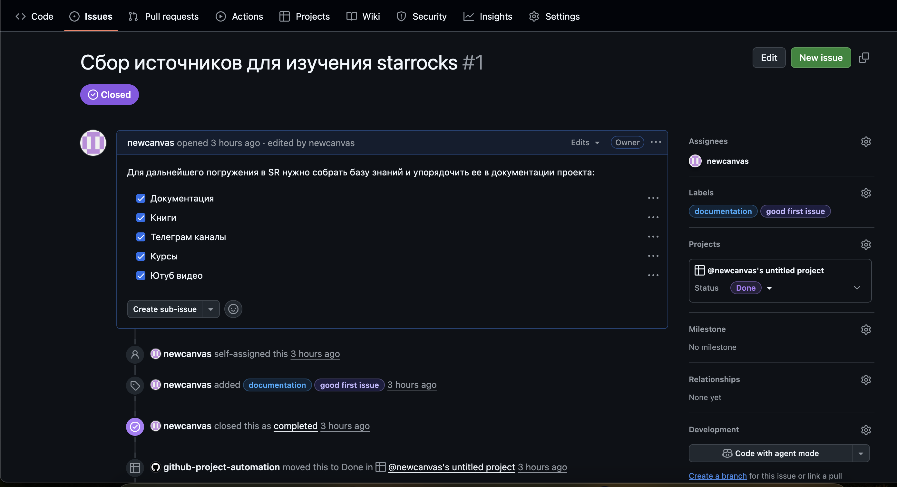
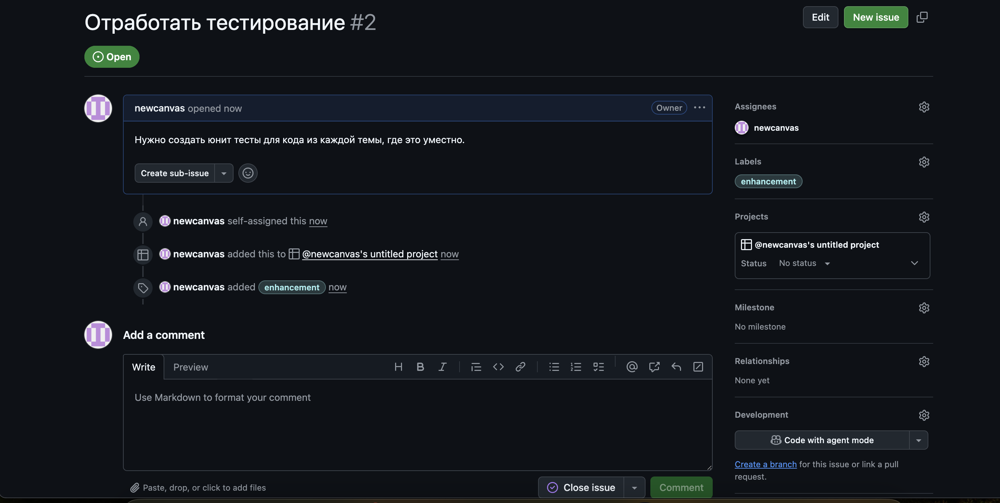

#Рефлексия
1. Слишком заморочно сделала условие со случайной строкой, действительно можно было просто использовать числа. Логика первых двух циклов схожа, а вот в конце использовала pop вместо удаления по ключу, и у меня нет проверки на ключ из-за этого.

2. Решение выполняет условие задачи, но мне для этого понадобилось три цикла вместо трех, структура требует доработки.

#Решение
С Jira работаю уже больше пяти лет, она была на всех рабочих проектах. Попробовала github issues, ощущается как jira в пальто, тоже удобный инструмент.

