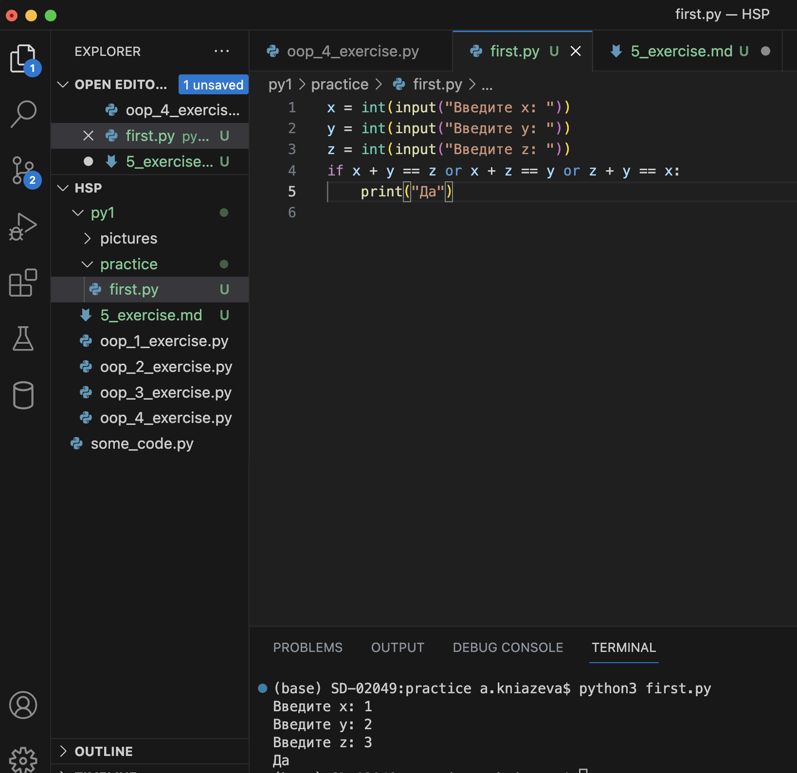

# Рефлексия
4.1.
Все-таки не до конца поняла композицию, с иерархией было проще разобраться. Насколько понимаю, моя реализация - тоже вариант композиции, но структура все же отличается от примера в эталонном решении.

4.2.
Массив заполнила корректно, но есть пара косяков.
Во-первых, можно было избавиться от переменной для рандома через условие, как это сделано в эталонном примере. 
Во-вторых, зря добавила print() в строке вызова функции, из-за этого и словила None, которые описала в ответе.

# Решение

